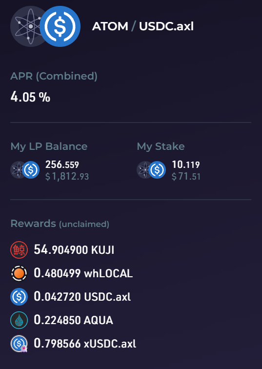

# 🔁 Redelegieren

Nachdem ein Delegierter KUJI an einen Validator gebunden hat, kann es vorkommen, dass er, aus welchen Gründen auch immer (der Validator stimmt in einer Weise ab, mit der er nicht einverstanden ist, der Validator wird zerschlagen, oder er bevorzugt einen anderen Validator, den er entdeckt hat), stattdessen einen anderen Validator einsetzen möchte.

Zum Glück erlaubt Kujira den Kujiranern, jederzeit (mit einem Vorbehalt) von einem Validator zu einem anderen zu wechseln. Dadurch wird sichergestellt, dass Kujiraner die volle Flexibilität bei der Wahl ihres Einsatzes haben. Die einzige Einschränkung besteht darin, dass zurückgegebene KUJI-Token erst nach einer 14-tägigen Abkühlungsphase wieder zurückgegeben werden können. Vergewissern Sie sich also, dass Sie die Token an den richtigen Validator weitergeben. &#x20;

Diese Abkühlungsphase dient der Sicherheit des Netzwerks.

Die Neuzuweisung erfolgt auf [der Staking-Seite](https://blue.kujira.app/stake) innerhalb der BLUE dApp. Wählen Sie einfach einen Validator aus, mit dem Sie derzeit einen Einsatz leisten. Und wählen Sie dann redelegate.

Als nächstes suchen Sie nach einem neuen Validator, den Sie neu delegieren möchten, wie im folgenden Bild zu sehen&#x20;

.png>)

Klicken Sie schließlich auf Redelegate KUJI, um den Vorgang abzuschließen&#x20;
